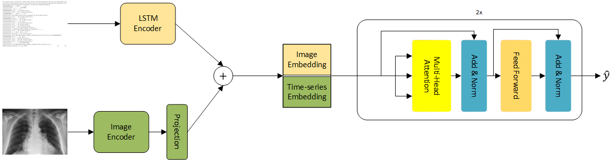

# multimodal-clinical
Code for Multimodal Healthcare Data Analysis for Enhanced Diagnostics and Patient Care.

## A Quick Overview 
Our proposed model consists of two major parts: modality-specific encoders and a
multimodal Transformer encoder as our modality fusion network. We use an image
encoder (e.g. a ResNet model) to extract features from our image modality and an
LSTM network to extract latent feature representation from our time-series modality.
We then utilize a projection layer to project the image embeddings to the time-series
embedding dimension. Finally, we concatenate these feature representations and feed
them to a Transformer encoder.




Dataset
-------------


We've used the [MIMIC-IV EHR](https://physionet.org/content/mimiciv/1.0/) and [MIMIC CXR](https://physionet.org/content/mimic-cxr-jpg/2.0.0/) datasets for our experiments.
We've also included the preprocessing [script for MIMIC-IV](mimic4extract/README.md). 
You should specify the ehr_data_dir and cxr_data_dir directories before running each script.


Use the following line to resize the cxr images.
```
python resize.py
```

The sample from training split of CXR dataset which are present in validation and test splits of EHR dataset are excluded, run the following.

```
python ehr_utils/create_split.py
```
use the following script to add noise for robustness test
```
python Add_noise.py
```

## Run

First you need to pretrain the modality encoders for each task using the pretraining scripts. Eg.
```
sh ./scripts/phenotyping/train/cxr_pretrain.sh
sh ./scripts/phenotyping/train/partial_ehr_pretrain.sh
```

Then you have to specify the directories of your saved checkpoints in the arguments.py file.

To fine-tune the model use the scripts provided.
```
sh ./scripts/phenotyping/train/attention_partial.sh
```

To evaluate the models  specify the directories of your model checkpoint and run the evaluation scripts. Eg.
```
sh ./scripts/phenotyping/eval/attention_partial.sh
```


## Cite
If you find this code useful, please cite